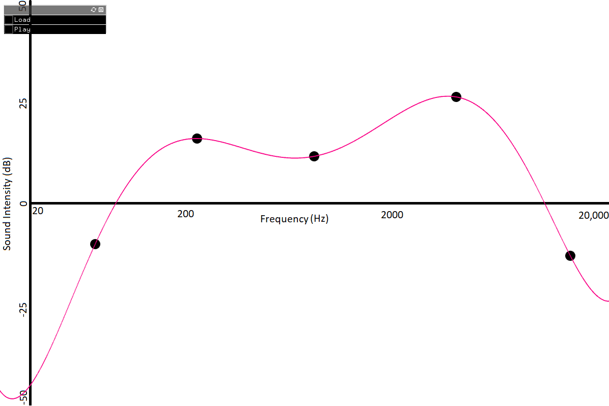

# Standalone Semi-Parametric Equalizer

This project is an attempt at making a parametric equalizer that can be used on WAV files. The resulting output WAV file is saved to the given output path.

## Dependencies
* [FFTW++](https://sourceforge.net/projects/fftwpp/) for performing time to frequency and frequency to time domain transformations
* [Soundstretch](https://www.surina.net/soundtouch/) for loading input WAV files and writing out new WAV files
* [ofxGUI](https://openframeworks.cc/documentation/ofxGui/) for the GUI (polynomial visualization, buttons etc.)

## How to run 
* Install g++
* Install Visual Studio
* Install dependencies (see Dependencies)
* Download project source code
* Set Output Path in kOutPath and kOutPathv2
* Now the program should be usable (see How to use for details on functionality)

## How to use
* Run the program. The screen should show white line with black circles along the line. There should also be two buttons in the top left corner. 
* Load a WAV file of your choice using the "Load" button
* Move the black circles to form a curve corresponding to the sound equalization you would like to perform on your input WAV file. 
* Click play. After converting the file, the altered audio will start playing. In order to get the WAV file corresponding to this audio, check the specified output path in kOutPath and kOutPathv2

    

